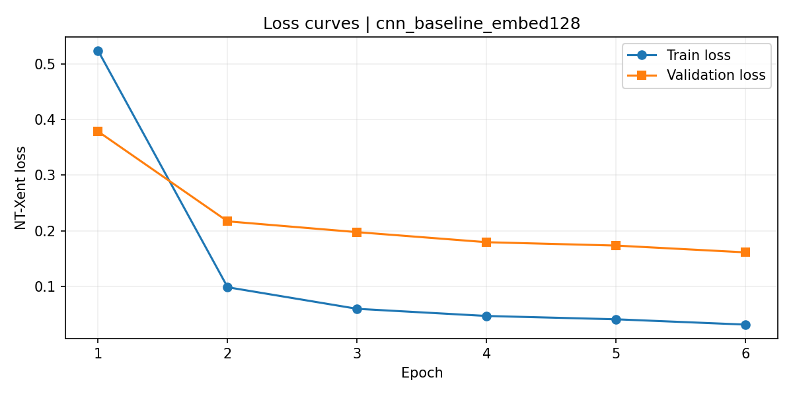
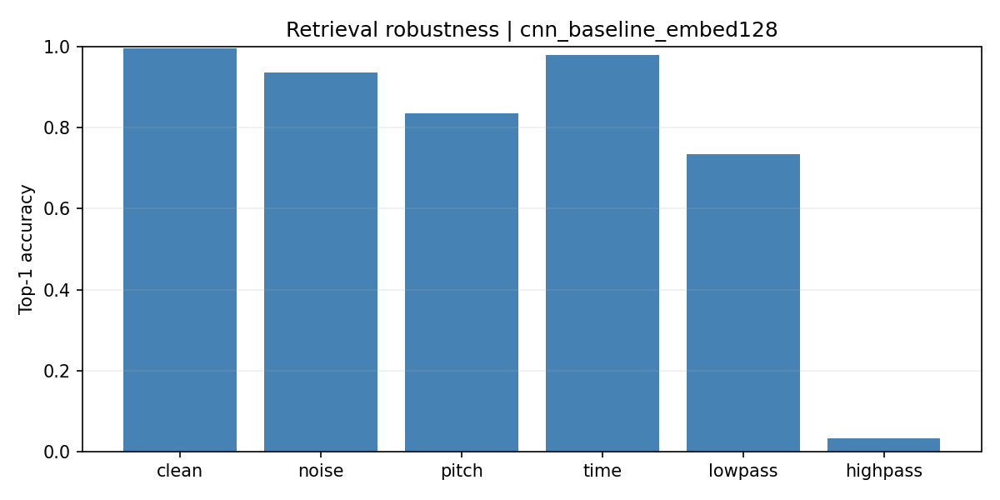
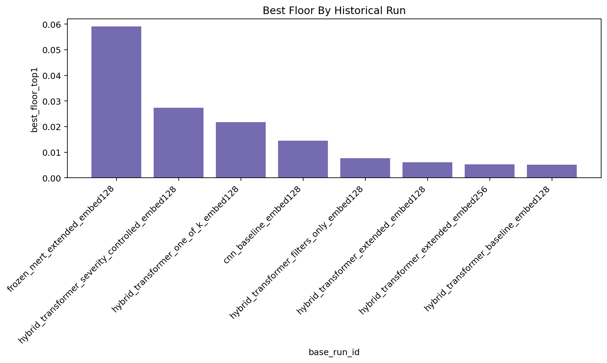

---
output:
  pdf_document: default
  html_document: default
---
# Transformer-Based Music Fingerprinting

## Contrastive Audio Fingerprinting with CNN, Hybrid Transformer, and Frozen MERT Architectures

**Authors:** Aritra Saharay, Aaron Gordoa, Edwin Yu

**Course:** CS7150 Deep Learning | Northeastern University | Spring 2026

**Repository:** [github.com/Ari-S-123/transformer-fingerprinting](https://github.com/Ari-S-123/transformer-fingerprinting)

**Date:** April, 24 2026

---

## Table of Contents

1. [Project Overview](#1-project-overview)
2. [Foundational Papers and Motivation](#2-foundational-papers-and-motivation)
3. [Technical Architecture](#3-technical-architecture)
4. [Development Process (Chronological)](#4-development-process-chronological)
   - 4.1 [Phase 1: Dataset Exploration (Notebook 1)](#41-phase-1-dataset-exploration-notebook-1)
   - 4.2 [Phase 2: Baseline Training & Retrieval (Notebook 2)](#42-phase-2-baseline-training--retrieval-notebook-2)
   - 4.3 [Phase 3: Robustness Ablation & Realistic Evaluation (Notebook 3)](#43-phase-3-robustness-ablation--realistic-evaluation-notebook-3)
   - 4.4 [Phase 4: Scale-Up to fma_medium (Notebook 4)](#44-phase-4-scale-up-to-fma_medium-notebook-4)
5. [Model Architectures](#5-model-architectures)
6. [Evaluation Framework](#6-evaluation-framework)
7. [Final Results](#7-final-results)
8. [Key Findings and Lessons Learned](#8-key-findings-and-lessons-learned)
9. [Honest Limitations and Future Work](#9-honest-limitations-and-future-work)
10. [References](#10-references)

---

## 1. Project Overview

This project investigates neural audio fingerprinting, the task of identifying a song from a short, potentially degraded audio query, using contrastive learning with transformer and CNN architectures. The system learns compact embedding representations of audio segments such that a degraded query can be matched to its source track via nearest-neighbor retrieval.

The project was structured as a scientific arc rather than a straight-line build. The initial hypothesis was that a hybrid spectrogram transformer would outperform a compact CNN baseline at audio fingerprinting. Through four progressive experimental notebooks, that hypothesis was tested, contradicted under harder evaluation, and ultimately overturned: the CNN baseline emerged as the strongest practical system.

### Project Scope

- **Three model families:** Compact CNN, Hybrid Spectrogram Transformer, Frozen MERT
- **Dataset:** Free Music Archive (FMA) -- fma_small (~8K tracks) and fma_medium (~25K tracks)
- **Training objective:** NT-Xent contrastive loss with in-batch negatives
- **Retrieval:** FAISS-based nearest-neighbor search with exact and approximate indexes
- **Degradations:** Gaussian noise, pitch shift, time stretch, low-pass/high-pass filtering
- **Evaluation:** Top-1/5/10 accuracy, MRR, worst-case floor, latency, and index size

### Final System Recommendation

The final recommended deployment configuration, validated at fma_medium scale (~25K tracks):

- **Model:** `cnn_baseline_embed128` (trained in Notebook 2)
- **Reference windowing:** `multi5_even` (5 evenly spaced fingerprints per track)
- **Retrieval index:** `ivfflat_nprobe8` (approximate FAISS, ~12x faster than exact)
- **Clean Top-1:** 0.8346 | **Mean degraded Top-1:** 0.3642 | **MRR:** 0.5774
- **Worst-condition Top-1:** 0.0145 | **Latency:** 0.0103 ms/query | **Index:** 6.41 MB

---

## 2. Foundational Papers and Motivation

The project builds directly on three published papers, each of which influenced a different aspect of the system design and evaluation methodology.

### Paper 1: "Neural Audio Fingerprint for High-Specific Audio Retrieval"

Chang, Lee, Park, Lim, Lee, Ko, Han (2021). Published at ICASSP 2021 ([arXiv:2010.11910](https://arxiv.org/abs/2010.11910)).

This paper established the core recipe adopted by our project: contrastive learning with NT-Xent loss and in-batch negatives for audio fingerprinting. It demonstrated that a neural network trained to produce compact embeddings from mel-spectrograms could achieve high-specificity audio retrieval. Our project adopted its loss function formulation, temperature parameter (0.07), mel-spectrogram configuration (1024 FFT, 256 hop, 128 mel bands), and the fundamental idea of using augmented versions of the same audio as positive pairs with other in-batch samples serving as negatives.

**Influence on our project:** Loss function, spectrogram pipeline, contrastive training paradigm.

### Paper 2: "Robust Neural Audio Fingerprinting using Music Foundation Models"

Singh, Bhat, Riley, Resnick, Thickstun, De Brouwer (2025). [arXiv:2511.05399](https://arxiv.org/abs/2511.05399).

This paper motivated our frozen MERT baseline. It showed that pre-trained music foundation models could serve as powerful feature extractors for fingerprinting when paired with a learned projection head. Rather than training an audio encoder from scratch, the frozen backbone provides rich musical representations that are then projected into a compact fingerprint space. Our project adopted this approach with the `m-a-p/MERT-v1-95M` music understanding model, keeping the backbone frozen and training a projection head for 128-dimensional fingerprints.

**Influence on our project:** Frozen MERT architecture and transfer learning strategy.

### Paper 3: "Contrastive and Transfer Learning for Effective Audio Fingerprinting"

Nikou & Giannakopoulos (2025). IJMSTA 7(1): 68-82 ([arXiv:2507.06070](https://arxiv.org/abs/2507.06070)).

This paper directly motivated the harder, more realistic evaluation protocol introduced in Notebook 3. It argued that standard benchmarks using clean, centered, fixed-length queries overestimate real-world fingerprinting performance. Following its guidance, we introduced short queries (1-3 seconds), off-center clips, combined moderate degradations, and multi-segment evidence scenarios. This upgraded benchmark ultimately changed our project's model recommendation, demonstrating that evaluation design can be more consequential than architecture choice.

**Influence on our project:** Realistic evaluation protocol that changed the project conclusion.

### Dataset Reference

Defferrard, Benzi, Vandergheynst, Bresson (2017). "FMA: A Dataset For Music Analysis." ISMIR 2017 ([arXiv:1612.01840](https://arxiv.org/abs/1612.01840)). The Free Music Archive provided all audio data, with fma_small (~8K tracks) used for initial experiments and fma_medium (~25K tracks) for final scale-up evaluation.

---

## 3. Technical Architecture

### Execution Environment

- **Recorded Notebook 4 platform:** Google Colab with NVIDIA H100 80GB HBM3 GPU
- **Recorded Notebook 4 Python/runtime:** Python 3.12.13 with PyTorch 2.10.0+cu128
- **Recorded Notebook 4 libraries:** Transformers 5.0.0 (Hugging Face), FAISS 1.13.2; Librosa is used for audio loading and augmentation but was not version-captured in `runtime_report.csv`
- **Spectrogram-model audio:** 16 kHz sample rate, log-mel spectrograms (1024 FFT, 256 hop, 128 mel bands)
- **MERT-model audio:** raw waveform input resampled through the `m-a-p/MERT-v1-95M` processor at its 24 kHz sample rate
- **Persistence:** Google Drive mount for artifact caching across sessions

### Audio Processing Pipeline

Raw audio files from the FMA dataset are loaded and normalized. For spectrogram-based models (CNN, Hybrid Transformer), audio is resampled to 16 kHz and converted to log-mel spectrograms with 128 frequency bins. For MERT, raw waveforms are passed through the MERT feature extractor at the model processor's 24 kHz sample rate. All query/reference windows are 3 seconds by duration; that is 48,000 samples for the 16 kHz spectrogram path and 72,000 samples for the 24 kHz MERT path.

### Contrastive Training Framework

The training framework uses the NT-Xent (Normalized Temperature-scaled Cross Entropy) loss. For each batch, anchor segments are paired with augmented positive versions of the same audio. All other samples in the batch serve as implicit negatives. The loss encourages the model to produce embeddings where same-track pairs have high cosine similarity while different-track pairs are pushed apart.

**Key training hyperparameters:**

- Batch size: 24 (CNN/Transformer), 8 (MERT due to memory constraints)
- Learning rate: 0.0001 for CNN/Hybrid Transformer runs; 0.001 for the frozen MERT projection-head run; weight decay: 0.0001
- Temperature: 0.07 (controls sharpness of similarity distribution)
- Epochs: 6 for CNN/Hybrid Transformer presets and 4 for the frozen MERT preset, with early stopping (patience = 3)
- Gradient clipping: max norm = 1.0
- Mixed precision (AMP) enabled for efficiency

### Retrieval System

At inference time, reference audio tracks are encoded into compact embeddings and indexed using FAISS. Query audio (potentially degraded) is encoded with the same model, and the nearest neighbors in the index are retrieved. The system supports multiple windowing strategies (1, 3, or 5 reference segments per track) and both exact and approximate index types.

---

## 4. Development Process

The project followed a four-phase chronological development, with each phase building on the artifacts and lessons of the previous one. Each phase corresponds to a Jupyter notebook and an accompanying progress report.

### 4.1 Phase 1: Dataset Exploration (Notebook 1)

**Notebook:** `01_fma_exploration.ipynb` | 28 cells (16 code, 12 markdown)

The first phase focused on understanding the FMA dataset and building the preprocessing pipeline. This included downloading and extracting the FMA metadata and audio files, exploring the distribution of genres, track durations, and audio quality, and establishing the core spectrogram generation and augmentation pipeline.

**Key Accomplishments:**

- Downloaded and validated FMA dataset (metadata + audio)
- Explored genre distributions, feature statistics, and duration profiles
- Implemented audio loading, resampling (16 kHz), and log-mel spectrogram generation
- Designed contrastive augmentation suite: Gaussian noise, pitch shift, time stretch, low-pass filtering, high-pass filtering
- Constructed positive/negative pair generation for contrastive learning
- Validated end-to-end data pipeline with visual sanity checks

**Relation to Papers:**
The spectrogram configuration (1024 FFT, 256 hop, 128 mel bands at 16 kHz) was adopted directly from Chang et al. (2021). The augmentation design was informed by all three papers, with the specific degradation types chosen to simulate real-world audio distortions.

---

### 4.2 Phase 2: Baseline Training & Retrieval (Notebook 2)

**Notebook:** `02_song_fingerprinting_experiments_colab.ipynb` | 29 cells | Run: April 3, 2026

The second phase was the core model training and initial evaluation stage. Three model families were trained on fma_small (~8K tracks) and evaluated on retrieval tasks with six degradation conditions.

**Models Trained:**

Five model variants were trained across three architecture families:

- **CNN Baseline (128-dim):** CompactSpectrogramCNN with 4 conv layers + projection head (~9 MB)
- **Hybrid Transformer Baseline (128-dim):** 2-block convolutional stem + patch projection + 4-layer transformer encoder with mean pooling (~48 MB)
- **Hybrid Transformer Extended (128-dim and 256-dim):** Same architecture, trained with filter augmentations
- **Frozen MERT (128-dim):** Pre-trained MERT backbone (frozen) + trainable projection head (~11 MB)

**Evaluation Protocol:**

Each model was evaluated on retrieval using centered 3-second query segments under six conditions: clean, Gaussian noise, pitch shift, time stretch, low-pass filter, and high-pass filter. Reference segments were indexed using FAISS exact inner-product search.


**Figure 1: Training loss curves for CNN baseline (NT-Xent loss)**

**Initial Results (Notebook 2):**

| Model | Mean Degraded Top-1 | Worst Top-1 | Clean Top-1 |
|---|---:|---:|---:|
| Hybrid Transformer Baseline | 0.7607 | 0.0075 | 0.9963 |
| CNN Baseline | 0.7040 | 0.0338 | 0.9963 |
| Frozen MERT | 0.6173 | 0.3013 | 0.9963 |
| Hybrid Transformer Ext. 128d | 0.3323 | 0.0725 | 0.9963 |
| Hybrid Transformer Ext. 256d | 0.2925 | 0.0875 | 0.9963 |

*Table 1: Notebook 2 retrieval results from `metrics.csv` on fma_small with centered 3-second queries. Mean degraded Top-1 averages noise, pitch, time, low-pass, and high-pass conditions.*


**Figure 2: CNN baseline retrieval robustness across degradation types**

**Critical Discovery: High-Pass Vulnerability**

The most important finding from Notebook 2 was the hybrid transformer's catastrophic failure on high-pass filtered queries (bass removed, simulating phone-line audio). While the hybrid transformer appeared strongest by mean degraded Top-1, its high-pass Top-1 accuracy was only 0.0075. The extended training variants improved high-pass robustness but degraded performance on other conditions, revealing that augmentation acts as selection pressure rather than a volume dial.

**Relation to Papers:**
The training recipe (NT-Xent loss, temperature 0.07, in-batch negatives) came directly from Chang et al. (2021). The frozen MERT approach was motivated by Singh et al. (2025). The discovery that the hybrid transformer collapsed on high-pass filtering, while MERT held up at ~53%, highlighted the importance of pre-trained representations for robustness.

---

### 4.3 Phase 3: Robustness Ablation & Realistic Evaluation (Notebook 3)

**Notebook:** `03_robustness_ablation_and_realistic_evaluation.ipynb` | 47 cells | Run: April 3, 2026

Notebook 3 was the turning point of the project. Its purpose was to stress-test the retrieval pipeline with a harder, more realistic benchmark inspired by Nikou & Giannakopoulos (2025).

**Benchmark Upgrades:**

Four major expansions to the evaluation framework:

**1. Policy-Driven Augmentation Training**

Three new hybrid transformer variants were trained with selective augmentation policies: one-of-k (random single degradation per sample), severity-controlled (variable intensity), and filters-only (only frequency filters, no noise/pitch/time).

**2. Harder Query Benchmark**

Following Nikou & Giannakopoulos (2025), queries were expanded beyond clean centered 3-second clips to include: short centered (1s, 2s, 3s), short off-center (1s, 2s, 3s), combined moderate degradations, and multi-segment same-track queries.

**3. Multi-Window Reference Indexing**

Instead of one centered reference per track, `multi3_even` indexed three evenly spaced windows per track, testing whether richer reference coverage improved retrieval.

**4. FAISS Index Sweep**

Notebook 3 exported 80 summary configurations, 400 FAISS/regime sweep rows, and 3,920 long-form metric rows across exact and approximate index types (IVFFlat, IVFPQ). These artifacts characterize the quality/latency/memory trade-off space without implying that all rows are independent model configurations.

**The Project Conclusion Changed**

Under the harder benchmark, the CNN baseline overtook the hybrid transformer as the best overall configuration. This was the most significant finding of the entire project: benchmark design changed the model recommendation.

| Configuration | Ranking Score | Mean Degraded Top-1 | Worst Top-1 |
|---|---:|---:|---:|
| **CNN Baseline (WINNER)** | **0.4749** | **0.4817** | **0.0239** |
| Frozen MERT | 0.3862 | 0.3000 | 0.1350 |
| One-of-k Policy | 0.3792 | 0.2995 | 0.1045 |
| Hybrid Transformer Baseline | 0.3777 | 0.3440 | 0.0066 |
| Severity Controlled | 0.3701 | 0.2880 | 0.1080 |

**Table 2: Best-per-run Notebook 3 results from `final_metrics_summary.csv` under the harder fma_small benchmark**

**Relation to Papers:**
The harder evaluation protocol was directly motivated by Nikou & Giannakopoulos (2025), who argued that standard benchmarks overestimate real-world performance. This paper's influence proved consequential: adopting a more realistic evaluation changed the entire project conclusion.

---

### 4.4 Phase 4: Scale-Up to fma_medium (Notebook 4)

**Notebook:** `04_fma_medium_scaleup_hard_negatives_and_temporal_aggregation.ipynb` | 56 cells | Run: April 16, 2026

The final notebook served as the project synthesis: scaling evaluation from fma_small to fma_medium (~25K tracks), re-evaluating all 8 historical checkpoints under the full evaluation matrix, and characterizing how scale affected the system's strengths and weaknesses.

**Scale-Up Details:**

- Dataset: fma_medium with 24,995 tracks (19,918 train / 2,505 val / 2,572 test)
- 5 bad-audio track IDs excluded in the dataset layout: 2 detected probe failures in `undecodable_audio_tracks.csv` plus 3 known-bad exclusions
- Evaluation: 8 runs x 3 windowing strategies x 5 index types = 120 configurations
- 6,000 detailed metric rows across 50 regime/condition/length combinations
- New windowing: `multi5_even` (5 reference segments per track)

**Planned But Not Executed:**

Notebook 4 contained scaffolded code for two additional interventions that were disabled in the final run due to a bug encountered during execution and exhausted Colab GPU credits:

- **Temporal aggregation:** combining multi-segment evidence for improved short-query retrieval
- **Hard-negative retraining:** mining false positives to improve discriminability

These remain well-motivated next steps. The team chose to document this honestly rather than hide the limitation.

**What Scale Revealed:**

The CNN winner held at fma_medium scale, but the robustness floor dropped disproportionately. Scaling from fma_small to fma_medium:

- Mean degraded Top-1 dropped 24.4% (0.4817 -> 0.3642)
- Worst-condition Top-1 dropped 39.3% (0.0239 -> 0.0145)
- Clean Top-1 dropped only 3.5% (0.8646 -> 0.8346)

This confirmed that scale exposes floor weaknesses more than it affects average-case performance.

---

## 5. Model Architectures

### 5.1 CompactSpectrogramCNN

The CNN baseline is a 4-layer convolutional network that processes log-mel spectrograms. Each layer uses Conv2d with stride-2 downsampling, batch normalization, and GELU activation. After adaptive average pooling to a single spatial position, a two-layer projection head maps the features to a 128-dimensional L2-normalized embedding.

```
Input: mel-spectrogram (1, 128, T)
  -> Conv2d(1->32, k=3, s=2) + BN + GELU
  -> Conv2d(32->64, k=3, s=2) + BN + GELU
  -> Conv2d(64->128, k=3, s=2) + BN + GELU
  -> Conv2d(128->256, k=3, s=2) + BN + GELU
  -> AdaptiveAvgPool2d((1,1))
  -> Linear(256->1024, GELU, Dropout)
  -> Linear(1024->128)
  -> L2 normalize
Output: 128-dim embedding  |  Checkpoint: ~9 MB
```

### 5.2 Hybrid Spectrogram Transformer

The hybrid model uses a compact convolutional stem followed by a patch projection and transformer encoder stack. The front-end applies two stride-2 convolutional blocks, projects the resulting feature map with `Conv2d(128->256, kernel_size=4, stride=4)`, reshapes the projected map into a token sequence, and processes it with 4 transformer encoder layers (d_model=256, 4 heads, ff_dim=1024). Mean pooling over the token sequence followed by a projection head produces the final embedding.

```
Input: mel-spectrogram (1, 128, T)
  -> Conv2d(1->64, k=3, s=2) + BN + GELU
  -> Conv2d(64->128, k=3, s=2) + BN + GELU
  -> Patch projection Conv2d(128->256, k=4, s=4)
  -> Reshape to sequence (freq_bins x time)
  -> Add learned positional embeddings
  -> TransformerEncoder(layers=4, d_model=256, heads=4, ff=1024)
  -> Mean pooling
  -> Linear(256->1024, GELU, Dropout) -> Linear(1024->128)
  -> L2 normalize
Output: 128-dim or 256-dim embedding  |  Checkpoint: ~48 MB
```

### 5.3 Frozen MERT Transformer

The MERT-based model uses `m-a-p/MERT-v1-95M`, a pre-trained music understanding model from the MERT family, as a frozen feature extractor. Only the projection head is trained. This approach, motivated by Singh et al. (2025) and implemented with the official MERT-v1-95M model checkpoint, leverages rich pre-trained musical representations without the cost of fine-tuning the full backbone.

```
Input: raw waveform (24 kHz MERT processor sample rate, normalized)
  -> MERT backbone (FROZEN, no gradients)
  -> Extract last hidden layer embeddings
  -> Linear(d_model->1024, GELU, Dropout)
  -> Linear(1024->128)
  -> L2 normalize
Output: 128-dim embedding  |  Checkpoint: ~11 MB (projection only)
```

### 5.4 Loss Function: NT-Xent

All models were trained with NT-Xent (Normalized Temperature-scaled Cross Entropy) loss, following Chang et al. (2021). For a batch of N anchor-positive pairs, the loss computes a similarity matrix of size NxN, treating the diagonal as positive matches and all off-diagonal entries as negatives. The symmetric formulation averages loss from both anchor-to-positive and positive-to-anchor directions, scaled by temperature tau=0.07.

---

## 6. Evaluation Framework

### 6.1 Query Regimes

The project progressively expanded its evaluation protocol across notebooks:

| Regime | Description | Introduced |
|---|---|---|
| `clean_current` | Clean centered 3s segments | Notebook 2 |
| `noise` / `pitch` / `time` | Single degradation, centered 3s | Notebook 2 |
| `lowpass` / `highpass` | Frequency filters, centered 3s | Notebook 2 |
| `short_centered` | Short clips (1s, 2s, 3s) from center | Notebook 3 |
| `short_offcenter` | Short clips from random positions | Notebook 3 |
| `combined_moderate` | Multiple simultaneous degradations | Notebook 3 |
| `multi_segment_same_track` | Fragmented evidence from same song | Notebook 3 |
| `realistic_hard` | Combined short + degraded + off-center | Notebook 4 |

**Table 3: Query regimes across the project timeline**

### 6.2 Reference Windowing Strategies

- **`single_center`:** 1 centered reference segment per track
- **`multi3_even`:** 3 evenly spaced segments per track (introduced Notebook 3)
- **`multi5_even`:** 5 evenly spaced segments per track (introduced Notebook 4)

### 6.3 FAISS Index Types

- **`exact_ip`:** Exact inner-product search (gold standard, highest latency)
- **`ivfflat_nprobe1/4/8`:** Inverted file index with varying probe counts
- **`ivfpq_nprobe4`:** Product quantization for compressed indexes (smallest size)

### 6.4 Ranking Metric

The composite ranking score balances mean degraded Top-1 accuracy, worst-condition floor, latency, and index size into a single scalar for configuration comparison. This metric was used consistently across Notebooks 3 and 4 to select the best overall system.

---

## 7. Final Results

The following results represent the final evaluation at fma_medium scale (~25K tracks), the most comprehensive and realistic benchmark in the project.

### 7.1 Cross-Model Comparison (Best Configuration Per Run)

| Run | Ranking Score | Mean Deg. Top-1 | Worst Top-1 | Clean Top-1 | Latency (ms/q) |
|---|---:|---:|---:|---:|---:|
| **`cnn_baseline_embed128`** | **0.4009** | **0.3642** | 0.0145 | **0.8346** | 0.0103 |
| `hybrid_trans_baseline` | 0.3139 | 0.2483 | 0.0052 | 0.5848 | 0.0094 |
| `frozen_mert_extended` | 0.3055 | 0.2062 | **0.0591** | 0.4571 | 0.0075 |
| `hybrid_one_of_k` | 0.2948 | 0.2051 | 0.0218 | 0.4651 | 0.0410 |
| `hybrid_severity_ctrl` | 0.2910 | 0.1968 | 0.0273 | 0.4369 | 0.0073 |
| `hybrid_filters_only` | 0.2743 | 0.1555 | 0.0076 | 0.3466 | 0.0072 |
| `hybrid_extended_128d` | 0.2210 | 0.0631 | 0.0061 | 0.3288 | 0.0073 |
| `hybrid_extended_256d` | 0.2105 | 0.0545 | 0.0053 | 0.3285 | 0.0076 |

**Table 4: Final cross-model comparison at fma_medium scale (best config per run)**


**Figure 3: Best worst-case floor by model -- Frozen MERT leads**

### 7.2 Windowing Effects on the CNN Winner

| Windowing | Clean Top-1 | Mean Deg. Top-1 | Worst Top-1 | Latency (ms/q) | Index (MB) |
|---|---:|---:|---:|---:|---:|
| `single_center` | 0.6512 | 0.3361 | 0.0148 | 0.0074 | 1.31 |
| `multi3_even` | 0.8050 | 0.3481 | 0.0142 | 0.0085 | 3.86 |
| `multi5_even` | 0.8346 | 0.3642 | 0.0145 | 0.0103 | 6.41 |

**Table 5: Impact of multi-window indexing on CNN baseline (ivfflat_nprobe8)**

### 7.3 FAISS Index Trade-offs

| Index | Mean Deg. Top-1 | Worst Top-1 | MRR | Latency (ms/q) | Index (MB) |
|---|---:|---:|---:|---:|---:|
| `exact_ip` | 0.3668 | 0.0146 | 0.5803 | 0.1234 | 6.28 |
| `ivfflat_nprobe8` | 0.3642 | 0.0145 | 0.5774 | 0.0103 | 6.41 |
| `ivfflat_nprobe4` | 0.3543 | 0.0144 | 0.5660 | 0.0089 | 6.41 |
| `ivfpq_nprobe4` | 0.2902 | 0.0105 | 0.5059 | 0.0089 | 0.45 |
| `ivfflat_nprobe1` | 0.2787 | 0.0119 | 0.4785 | 0.0084 | 6.41 |

**Table 6: FAISS index comparison for CNN winner with multi5_even windowing**

### 7.4 Scale-Up Impact (Notebook 3 vs. Notebook 4)

| Metric | NB3 (fma_small) | NB4 (fma_medium) | Change |
|---|---:|---:|---:|
| Ranking score | 0.4749 | 0.4009 | -15.6% |
| Mean degraded Top-1 | 0.4817 | 0.3642 | -24.4% |
| Worst-condition Top-1 | 0.0239 | 0.0145 | -39.3% |
| Clean Top-1 | 0.8646 | 0.8346 | -3.5% |

*Table 7: Impact of scaling from fma_small to fma_medium on the CNN winner*

---

## 8. Key Findings and Lessons Learned

### 8.1 Benchmark Design Matters More Than Architecture

The single most important lesson from this project is that evaluation design can overturn architecture-level conclusions. The same models, evaluated under a harder benchmark, produced a different winner. The hybrid transformer appeared strongest under Notebook 2's easier evaluation, but the CNN baseline won decisively once realistic query conditions were introduced in Notebook 3. This finding persisted through the fma_medium scale-up in Notebook 4.

### 8.2 Augmentation Is Selection Pressure, Not a Volume Dial

Adding more augmentations during training does not uniformly improve robustness. Instead, augmentation acts as selection pressure that reshapes which invariances the model learns. The "extended" training variants (with additional filter augmentations) improved high-pass robustness but degraded performance on noise, pitch, and time-stretch. Selective augmentation policies (one-of-k, severity-controlled) achieved better balance but still could not surpass the CNN baseline.

### 8.3 Multi-Window Indexing Is a "Cheap" Win

Multi-window reference indexing (indexing multiple segments per track instead of one) was the most effective system-level upgrade validated by the project. For the CNN winner, moving from `single_center` to `multi5_even` improved clean Top-1 by 18 percentage points with only 0.003 ms additional latency per query. This required no retraining, making it a pure inference-time improvement.

### 8.4 Approximate Search Is Good Enough

The final winning configuration used approximate FAISS search (`ivfflat_nprobe8`) rather than exact search. The quality loss was negligible (-0.0025 in mean degraded Top-1) while latency improved by ~12x. This validates approximate search as production-viable for this scale.

### 8.5 Best Overall vs. Best Floor Are Different Objectives

The CNN wins on overall ranking score, but frozen MERT has a 4x better worst-case floor (0.0591 vs. 0.0145). MERT's pre-trained representations make it less catastrophically vulnerable to any single degradation type, even though its average retrieval is weaker. The choice between these models depends on whether the deployment prioritizes average-case throughput or worst-case reliability.

### 8.6 Hypothesis Evolution

| Stage | Hypothesis | Result |
|---|---|---|
| Start | Hybrid transformer beats CNN | Contradicted |
| Notebook 2 | Extended augmentation fixes robustness | Partially true, with trade-offs |
| Notebook 3 | Harder benchmark preserves ranking | Contradicted: CNN won |
| Notebook 4 | Winner stable at larger scale | Confirmed, but floor worsened |
| Notebook 4 | Scale exposes floor > mean | Confirmed (39.3% vs 24.4%) |

**Table 8: Hypothesis evolution across the project**

---

## 9. Honest Limitations and Future Work

### 9.1 Remaining Weaknesses

The winning CNN system still fails on short, off-center, high-pass-filtered queries with Top-1 accuracy near 1%. This represents the sharpest unresolved weakness.

| Regime | Condition | Length | Top-1 |
|---|---|---:|---:|
| `short_offcenter` | highpass | 1.0s | 0.0097 |
| `short_offcenter` | highpass | 3.0s | 0.0121 |
| `short_offcenter` | highpass | 2.0s | 0.0132 |
| `short_centered` | highpass | 1.0s | 0.0140 |
| `short_centered` | highpass | 2.0s | 0.0167 |
| `realistic_hard` | realistic_hard | 1.0s | 0.0408 |

**Table 9: Hardest failure modes for the final recommended system**

### 9.2 Unexecuted Experiments

Two planned interventions were scaffolded in Notebook 4 but not executed due to a runtime bug and exhausted Colab GPU credits:

- **Temporal aggregation:** Combining evidence from multiple short segments of the same query to improve retrieval for fragmented evidence. Four aggregation modes were planned: `single_segment_top1`, `segment_vote_topk`, `weighted_segment_vote`, and `temporal_consistency_huber`.
- **Hard-negative retraining:** Mining acoustically similar false positives from the retrieval index and re-training the model to better discriminate between them. Configuration included 2048 candidate tracks, 2 negatives per anchor, and 3 retraining epochs.

### 9.3 Future Directions

- Execute temporal aggregation and hard-negative retraining experiments
- Scale to fma_full or larger datasets to further stress-test robustness
- Fine-tune MERT backbone (not just frozen) to combine its floor advantage with stronger average retrieval
- Investigate query-aware augmentation: focusing training augmentations on the specific degradation combinations that cause the worst failures
- Explore larger transformer architectures with more training data to revisit the transformer vs. CNN question at scale

---

## 10. References

[1] Chang, S., Lee, D., Park, J., Lim, H., Lee, K., Ko, K., & Han, Y. (2021). "Neural Audio Fingerprint for High-Specific Audio Retrieval Based on Contrastive Learning." *ICASSP 2021*. [arXiv:2010.11910](https://arxiv.org/abs/2010.11910).

[2] Singh, S., Bhat, S., Riley, M., Resnick, C., Thickstun, J., & De Brouwer, E. (2025). "Robust Neural Audio Fingerprinting using Music Foundation Models." [arXiv:2511.05399](https://arxiv.org/abs/2511.05399).

[3] Nikou, A. & Giannakopoulos, T. (2025). "Contrastive and Transfer Learning for Effective Audio Fingerprinting through a Real-World Evaluation Protocol." *International Journal of Music Science, Technology and Art*, 7(1): 68-82. [arXiv:2507.06070](https://arxiv.org/abs/2507.06070).

[4] Defferrard, M., Benzi, K., Vandergheynst, P., & Bresson, X. (2017). "FMA: A Dataset For Music Analysis." *ISMIR 2017*. [arXiv:1612.01840](https://arxiv.org/abs/1612.01840).

[5] m-a-p. `MERT-v1-95M` model card. Hugging Face. [https://huggingface.co/m-a-p/MERT-v1-95M](https://huggingface.co/m-a-p/MERT-v1-95M).
